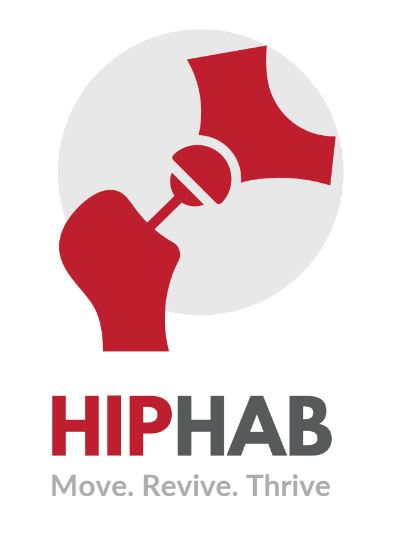
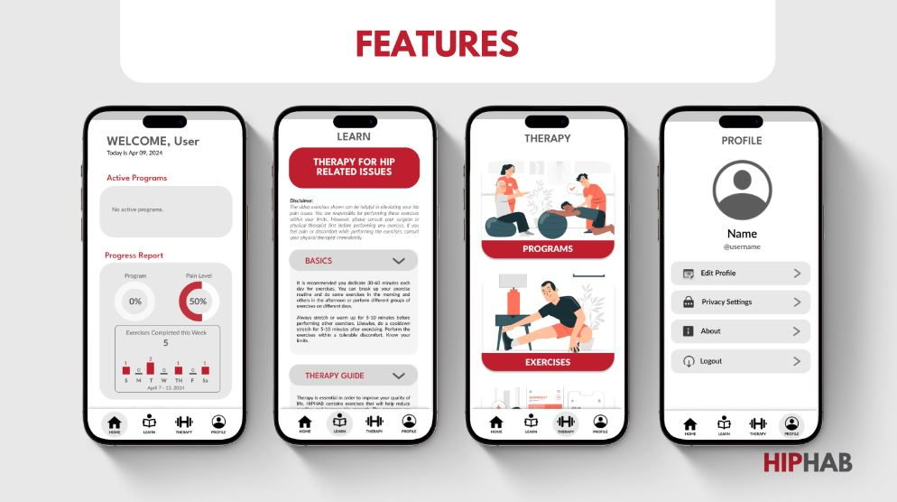

# ABOUT

It's a mobile application that
complements physical therapists'
hip rehabilitation programs. It
offers tailored exercises and
guidance for independent use at
home, especially when direct
supervision isn't necessary.

Thereby potentially saving time
and cost for individuals managing
their hip conditions.

## Features

-  User authentication
-  User profile
-  Exercise library
-  Exercise tracking
-  Progress tracking

